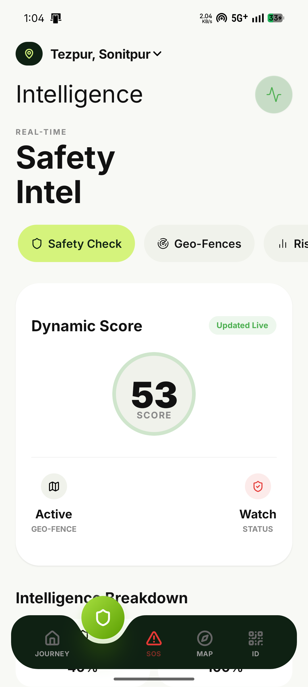
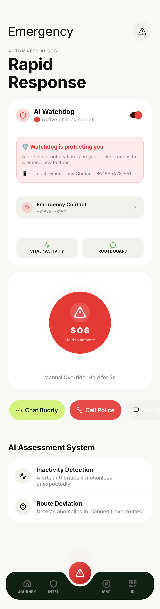

# Trientra 🛡️ 

**Proactive AI-Powered Safety & Intelligence Platform for Travelers**

Trientra is not just another travel map—it's an intelligent, proactive guardian. By fusing real-time AI intelligence, automated safety systems, and digital convenience, Trientra ensures that tourists and commuters can explore with complete peace of mind.

---

## 📸 App Showcase

### 🤖 Core Intelligence & Journey
| Adaptive Journey | AI Intelligence | Live Mapping |
| :---: | :---: | :---: |
|  |  |  |
| *Personalized Routes* | *Discovery Engine* | *Real-time Tracking* |

### 🛡️ Safety & Identity
| AI Watchdog (SOS) | Digital Identity Pass | Live Notifications |
| :---: | :---: | :---: |
|  |  |  |
| *Lock-screen Protection* | *Unified QR Access* | *Persistent Awareness* |

---

## 🔥 Key Differentiators

Trientra goes far beyond reactive emergency apps by introducing state-of-the-art predictive systems:

### 1. 🛡️ AI Watchdog (Lock-screen Protection)
The flagship safety feature. When activated, Trientra places a persistent, high-priority widget on your **lock screen**. This allows immediate access to three critical actions without needing to unlock the phone:
*   🎙 **Stealth Recording**: Capture audio evidence saved locally in a secure SQLite vault.
*   📍 **Emergency Location**: Instantly broadcast your real-time GPS coordinates to your contact.
*   🚨 **Mayday SOS**: A one-tap trigger that sends a high-priority "Come Save Me" SMS to your emergency contact with your live location.

### 2. 🆔 Unified QR Digital Identity
A single secure QR code replaces passports, visa docs, parking tickets, and monument e-passes. Trientra integrates your essential travel documents into one digital vault, allowing for instant verification at checkpoints.

### 3. 🧠 Smart Journey Intelligence
Trientra analyzes your route to pre-warn you about upcoming service gaps and highlights nearby essential safety infrastructure like hospitals, safe havens, and police stations.

### 4. 🚗 Dynamic Booking System
Safety meets convenience. Trientra directly integrates parking spot reservations and monument e-ticketing dynamically, saving time and keeping tourists out of crowded, chaotic areas.

---

## 💻 Tech Stack

- **Framework**: React Native (Expo Router)
- **Styling**: NativeWind (Tailwind CSS) + Vanilla CSS
- **Database**: `expo-sqlite` (Local Evidence Vault)
- **Native Logic**: Kotlin (Android Foreground Services & Broadcast Receivers)
- **Audio/SMS**: `expo-av` & `expo-sms`
- **Maps**: MapLibre GL & Geocoding Services
- **UI Icons**: Lucide React Native

---

## 🚀 Getting Started

1. Clone the repository and navigate into the project directory
2. Install dependencies:
   ```bash
   npm install
   ```
3. Start the Expo development server:
   ```bash
   npx expo start -c
   ```
4. **Build Native Android App**:
   Since this app uses custom native modules (Watchdog service), you need a development build:
   ```bash
   npx expo run:android
   ```

---

<div align="center">
  <p><i>Empowering safe travel through proactive intelligence.</i></p>
</div>
